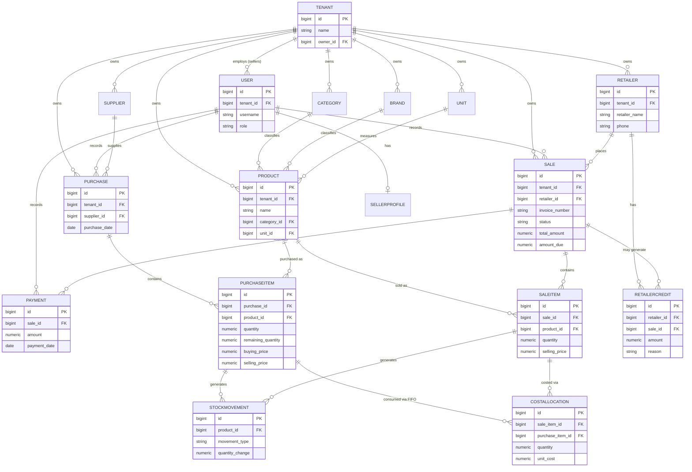

# StockLedger — Technical Design Documentation

Backend: Python · Django · Django REST Framework · PostgreSQL
Companion file: `StockLedger_Schema.sql` (runnable DDL, validated against PostgreSQL 16)

---

## 0. How to Read This Document

Everything here builds directly on the business rules and architecture you finalized
(FIFO costing, editable invoices, multi-product invoices, partial payments, Service
Layer, StockMovement ledger, multi-tenant readiness, app split, model list, reporting,
roles, workflows, invoice numbering).

A few structural details were **not** finalized in that discussion (e.g. exact columns,
constraints, invoice-edit mechanics, retailer credit implementation, stock valuation
formula, low-stock threshold, invoice number date format). To turn agreed rules into a
working schema, those gaps had to be filled in. Every such item is marked
**`PROPOSED`** below and in the schema file — treat these as a first draft to confirm
or change, not as decided.

---

## 1. Assumptions & Proposed Decisions

| Area | Gap | Proposed default | Why |
|---|---|---|---|
| Invoice number format | Date portion not finalized | `INV-YYYYMMDD-000001` (compact, resets daily per tenant) | Matches your original example most closely; easy to change to monthly/yearly reset later |
| Low stock threshold | Not discussed | Per-product nullable field `low_stock_threshold` | Lets each product have its own reorder point instead of one global number |
| Stock valuation formula | Not finalized | `SUM(remaining_quantity × buying_price)` across all open FIFO layers | Direct extension of the FIFO rule you already agreed on |
| Invoice editing — stock effect | Not finalized | Edits reverse the old `StockMovement`/cost-allocation rows and re-run allocation for the new quantities (see §6.2) | Only way to keep the ledger accurate given "invoices are editable" |
| Retailer credit | Not finalized | Ledger table (`payments_retailercredit`) instead of a single balance field | Consistent with the StockMovement ledger philosophy you already chose — auditable, not just a number that changes |
| Product deactivation | Not discussed | `is_active` flag on Product/Retailer instead of hard delete | Standard practice; keeps historical invoices intact even if a product is discontinued |
| Payment method | Not discussed | Optional free-text/enum field on Payment | Small addition, useful for records, doesn't affect any agreed logic |

Everything else below is a direct, literal translation of what was agreed.

---

## 2. Entity-Relationship Diagram



> `COSTALLOCATION` = `sales_saleitemcostallocation` — the table that records exactly
> which FIFO purchase layer(s) each sale item's cost came from. It's what makes FIFO
> actually computable and lets an edited invoice cleanly "give back" stock to the
> right layer.

---

## 3. Database Schema Summary

Full runnable DDL is in `StockLedger_Schema.sql` (validated against real PostgreSQL —
every table, constraint, and foreign key was created successfully, and a full
purchase → sale → FIFO allocation → payment flow was tested end to end). This section
is a readable reference; the `.sql` file is the source of truth.

| Table | Purpose |
|---|---|
| `tenants_tenant` | The business account (one per Super Admin, ready for multiple sellers later) |
| `accounts_user` | Login + role (`SUPER_ADMIN` / `SELLER`) |
| `tenants_sellerprofile` | Extra info about a seller user (phone, etc.) |
| `catalog_category`, `catalog_brand`, `catalog_unit` | Product classification, scoped per tenant |
| `catalog_product` | The products being distributed |
| `inventory_supplier` | Who products are bought from |
| `inventory_purchase` | One purchase transaction (header) |
| `inventory_purchaseitem` | One product line in a purchase — **this is a FIFO layer**: `remaining_quantity` shrinks as it's sold |
| `customers_retailer` | The shops being sold to |
| `sales_invoicesequence` | Backs safe, per-tenant sequential invoice numbers |
| `sales_sale` | Invoice header |
| `sales_saleitem` | One product line in an invoice |
| `inventory_stockmovement` | Append-only ledger of every stock change (purchase in, sale out, and reserved types for damage/adjustment/return) |
| `sales_saleitemcostallocation` | Links a sale item to the exact purchase layer(s) it consumed, with locked-in cost — the FIFO "receipt" |
| `payments_payment` | Each individual payment recorded against an invoice |
| `payments_retailercredit` | `PROPOSED` — ledger of retailer credit from overpayments |

**Every table except `accounts_user` and `tenants_tenant` carries `tenant_id`** so
data is scoped per business account from day one, even with a single seller.

---

## 4. Django App & Model Reference

Matches the app split you agreed on. `common/models.py` holds a shared base:

```python
# common/models.py
from django.db import models

class TimeStampedModel(models.Model):
    created_at = models.DateTimeField(auto_now_add=True)
    updated_at = models.DateTimeField(auto_now=True)

    class Meta:
        abstract = True


class TenantScopedModel(TimeStampedModel):
    tenant = models.ForeignKey("tenants.Tenant", on_delete=models.CASCADE)

    class Meta:
        abstract = True
```

### `accounts/`

```python
from django.contrib.auth.models import AbstractUser
from django.db import models

class User(AbstractUser):
    class Role(models.TextChoices):
        SUPER_ADMIN = "SUPER_ADMIN", "Super Admin"
        SELLER = "SELLER", "Seller"

    tenant = models.ForeignKey(
        "tenants.Tenant", null=True, blank=True,
        on_delete=models.CASCADE, related_name="users"
    )
    role = models.CharField(max_length=20, choices=Role.choices)
```

### `tenants/`

```python
from django.db import models
from common.models import TimeStampedModel

class Tenant(TimeStampedModel):
    name = models.CharField(max_length=255)
    owner = models.ForeignKey(
        "accounts.User", on_delete=models.RESTRICT, related_name="owned_tenants"
    )


class SellerProfile(TimeStampedModel):
    user = models.OneToOneField("accounts.User", on_delete=models.CASCADE)
    tenant = models.ForeignKey(Tenant, on_delete=models.CASCADE)
    phone_number = models.CharField(max_length=20, blank=True)
```

### `catalog/`

```python
from django.db import models
from common.models import TenantScopedModel

class Category(TenantScopedModel):
    name = models.CharField(max_length=150)

    class Meta:
        unique_together = ("tenant", "name")


class Brand(TenantScopedModel):
    name = models.CharField(max_length=150)

    class Meta:
        unique_together = ("tenant", "name")


class Unit(TenantScopedModel):
    name = models.CharField(max_length=50)          # Bottle, Packet, Box...
    short_code = models.CharField(max_length=10, blank=True)

    class Meta:
        unique_together = ("tenant", "name")


class Product(TenantScopedModel):
    name = models.CharField(max_length=255)
    category = models.ForeignKey(Category, on_delete=models.RESTRICT)
    brand = models.ForeignKey(Brand, null=True, blank=True, on_delete=models.SET_NULL)
    unit = models.ForeignKey(Unit, on_delete=models.RESTRICT)
    sku = models.CharField(max_length=64, blank=True)
    current_selling_price = models.DecimalField(max_digits=10, decimal_places=2, null=True, blank=True)
    low_stock_threshold = models.DecimalField(max_digits=12, decimal_places=3, null=True, blank=True)
    is_active = models.BooleanField(default=True)

    class Meta:
        unique_together = ("tenant", "sku")
```

### `inventory/`

```python
from django.db import models
from common.models import TenantScopedModel

class Supplier(TenantScopedModel):
    name = models.CharField(max_length=255)
    phone = models.CharField(max_length=20, blank=True)


class Purchase(TenantScopedModel):
    supplier = models.ForeignKey(Supplier, null=True, blank=True, on_delete=models.SET_NULL)
    recorded_by = models.ForeignKey("accounts.User", on_delete=models.RESTRICT)
    purchase_date = models.DateField()
    notes = models.TextField(blank=True)
    total_amount = models.DecimalField(max_digits=12, decimal_places=2, default=0)


class PurchaseItem(models.Model):
    purchase = models.ForeignKey(Purchase, on_delete=models.CASCADE, related_name="items")
    product = models.ForeignKey("catalog.Product", on_delete=models.RESTRICT)
    quantity = models.DecimalField(max_digits=12, decimal_places=3)
    remaining_quantity = models.DecimalField(max_digits=12, decimal_places=3)   # FIFO layer tracker
    buying_price = models.DecimalField(max_digits=10, decimal_places=2)
    selling_price = models.DecimalField(max_digits=10, decimal_places=2)
    created_at = models.DateTimeField(auto_now_add=True)
    updated_at = models.DateTimeField(auto_now=True)


class StockMovement(models.Model):
    class MovementType(models.TextChoices):
        PURCHASE = "PURCHASE", "Purchase"
        SALE = "SALE", "Sale"
        ADJUSTMENT = "ADJUSTMENT", "Adjustment"
        DAMAGE = "DAMAGE", "Damage"
        RETURN = "RETURN", "Return"

    tenant = models.ForeignKey("tenants.Tenant", on_delete=models.CASCADE)
    product = models.ForeignKey("catalog.Product", on_delete=models.RESTRICT)
    movement_type = models.CharField(max_length=20, choices=MovementType.choices)
    quantity_change = models.DecimalField(max_digits=12, decimal_places=3)
    related_purchase_item = models.ForeignKey(PurchaseItem, null=True, blank=True, on_delete=models.SET_NULL)
    related_sale_item = models.ForeignKey(
        "sales.SaleItem", null=True, blank=True, on_delete=models.SET_NULL
    )
    note = models.TextField(blank=True)
    created_by = models.ForeignKey("accounts.User", null=True, on_delete=models.SET_NULL)
    created_at = models.DateTimeField(auto_now_add=True)
```

### `customers/`

```python
from common.models import TenantScopedModel
from django.db import models

class Retailer(TenantScopedModel):
    retailer_name = models.CharField(max_length=255)
    shop_name = models.CharField(max_length=255, blank=True)
    phone = models.CharField(max_length=20)
    email = models.EmailField(blank=True)
    address = models.TextField(blank=True)
    credit_balance = models.DecimalField(max_digits=10, decimal_places=2, default=0)
    is_active = models.BooleanField(default=True)

    class Meta:
        unique_together = ("tenant", "phone")
```

### `sales/`

```python
from django.db import models
from common.models import TenantScopedModel

class InvoiceSequence(models.Model):
    tenant = models.ForeignKey("tenants.Tenant", on_delete=models.CASCADE)
    period_key = models.CharField(max_length=20)     # e.g. "20260723"
    last_number = models.IntegerField(default=0)

    class Meta:
        unique_together = ("tenant", "period_key")


class Sale(TenantScopedModel):
    class Status(models.TextChoices):
        PAID = "PAID", "Paid"
        PARTIAL = "PARTIAL", "Partial"
        UNPAID = "UNPAID", "Unpaid"

    retailer = models.ForeignKey("customers.Retailer", on_delete=models.RESTRICT)
    seller = models.ForeignKey("accounts.User", on_delete=models.RESTRICT)
    invoice_number = models.CharField(max_length=30)
    invoice_date = models.DateField()
    status = models.CharField(max_length=10, choices=Status.choices, default=Status.UNPAID)
    subtotal = models.DecimalField(max_digits=12, decimal_places=2, default=0)
    total_amount = models.DecimalField(max_digits=12, decimal_places=2, default=0)
    amount_paid = models.DecimalField(max_digits=12, decimal_places=2, default=0)
    amount_due = models.DecimalField(max_digits=12, decimal_places=2, default=0)
    notes = models.TextField(blank=True)
    is_edited = models.BooleanField(default=False)

    class Meta:
        unique_together = ("tenant", "invoice_number")


class SaleItem(models.Model):
    sale = models.ForeignKey(Sale, on_delete=models.CASCADE, related_name="items")
    product = models.ForeignKey("catalog.Product", on_delete=models.RESTRICT)
    quantity = models.DecimalField(max_digits=12, decimal_places=3)
    selling_price = models.DecimalField(max_digits=10, decimal_places=2)
    line_total = models.DecimalField(max_digits=12, decimal_places=2)
    created_at = models.DateTimeField(auto_now_add=True)
    updated_at = models.DateTimeField(auto_now=True)


class SaleItemCostAllocation(models.Model):
    sale_item = models.ForeignKey(SaleItem, on_delete=models.CASCADE, related_name="cost_allocations")
    purchase_item = models.ForeignKey("inventory.PurchaseItem", on_delete=models.RESTRICT)
    quantity = models.DecimalField(max_digits=12, decimal_places=3)
    unit_cost = models.DecimalField(max_digits=10, decimal_places=2)
    created_at = models.DateTimeField(auto_now_add=True)
```

### `payments/`

```python
from django.db import models
from common.models import TenantScopedModel

class Payment(TenantScopedModel):
    sale = models.ForeignKey("sales.Sale", on_delete=models.CASCADE, related_name="payments")
    amount = models.DecimalField(max_digits=10, decimal_places=2)
    payment_date = models.DateField()
    payment_method = models.CharField(max_length=30, blank=True)
    note = models.TextField(blank=True)
    recorded_by = models.ForeignKey("accounts.User", on_delete=models.RESTRICT)


class RetailerCredit(TenantScopedModel):
    class Reason(models.TextChoices):
        OVERPAYMENT = "OVERPAYMENT", "Overpayment"
        APPLIED = "APPLIED_TO_INVOICE", "Applied to invoice"
        MANUAL = "MANUAL_ADJUSTMENT", "Manual adjustment"

    retailer = models.ForeignKey("customers.Retailer", on_delete=models.CASCADE)
    sale = models.ForeignKey("sales.Sale", null=True, blank=True, on_delete=models.SET_NULL)
    amount = models.DecimalField(max_digits=10, decimal_places=2)
    reason = models.CharField(max_length=20, choices=Reason.choices)
    note = models.TextField(blank=True)
```

### `reports/`

No models — read-only endpoints that query across the apps above (see §7).

---

## 5. Service Layer

Business logic lives in service classes, not serializers or views:

```
inventory/services.py   → PurchaseService, StockService
sales/services.py       → SaleService (create + edit invoices)
payments/services.py    → PaymentService
```

Views/ViewSets stay thin: validate the request shape via a serializer, call a service
method, return the result.

---

## 6. Core Business Logic

### 6.1 FIFO Consumption (on sale creation)

```
SaleService.create_sale(retailer, items, seller):
    for each requested item (product, quantity, selling_price):
        layers = PurchaseItem.objects
                    .filter(product=product, remaining_quantity__gt=0)
                    .order_by("purchase__purchase_date", "id")   # oldest first
                    .select_for_update()

        qty_needed = quantity
        for layer in layers:
            if qty_needed <= 0: break
            take = min(qty_needed, layer.remaining_quantity)

            SaleItemCostAllocation.objects.create(
                sale_item=sale_item, purchase_item=layer,
                quantity=take, unit_cost=layer.buying_price
            )
            layer.remaining_quantity -= take
            layer.save()

            StockMovement.objects.create(
                product=product, movement_type="SALE",
                quantity_change=-take, related_purchase_item=layer,
                related_sale_item=sale_item
            )
            qty_needed -= take

        if qty_needed > 0:
            raise InsufficientStockError(product)
```

`select_for_update()` locks the layer rows so two simultaneous sales can't both
"consume" the same stock.

### 6.2 Invoice Editing

Since invoices are editable and this wasn't fully specified, the safest approach that
preserves FIFO/ledger accuracy:

1. On edit, **reverse** the sale's existing effect first: for each `SaleItemCostAllocation`
   row, add the quantity back to `purchase_item.remaining_quantity`, and write an
   offsetting `StockMovement` (or simply delete the original movement + allocation rows
   inside the same transaction).
2. **Re-run** FIFO allocation (§6.1) against the new item list.
3. Recalculate `subtotal` / `total_amount`, set `is_edited = True`.
4. Existing `Payment` rows are untouched — `amount_paid` stays the same, only
   `amount_due` and `status` are recalculated against the new total.

*Open question for you and your father:* if the new total is less than what's already
been paid, does the difference become retailer credit? Recommend confirming this before
building the edit endpoint.

### 6.3 Payment Recording & Allocation

```
PaymentService.record_payment(sale, amount, date, method):
    Payment.objects.create(sale=sale, amount=amount, payment_date=date, ...)

    sale.amount_paid += amount
    if sale.amount_paid >= sale.total_amount:
        overpaid = sale.amount_paid - sale.total_amount
        sale.amount_paid = sale.total_amount
        sale.status = "PAID"
        if overpaid > 0:
            RetailerCredit.objects.create(
                retailer=sale.retailer, sale=sale,
                amount=overpaid, reason="OVERPAYMENT"
            )
    else:
        sale.status = "PARTIAL"

    sale.amount_due = sale.total_amount - sale.amount_paid
    sale.save()
```

Which invoice a payment applies to is **always chosen explicitly by the seller** — no
automatic allocation across multiple unpaid invoices.

### 6.4 Invoice Numbering

```
InvoiceService.generate_number(tenant):
    period_key = today.strftime("%Y%m%d")     # PROPOSED format — confirm with father
    seq, _ = InvoiceSequence.objects.select_for_update().get_or_create(
        tenant=tenant, period_key=period_key
    )
    seq.last_number += 1
    seq.save()
    return f"INV-{period_key}-{seq.last_number:06d}"
    # → INV-20260723-000001
```

`select_for_update()` again prevents two invoices created at the same moment from
getting the same number.

---

## 7. API Design (Django REST Framework)

JWT auth assumed (e.g. `djangorestframework-simplejwt`) — confirm if you'd rather use
session or token auth instead. All endpoints below are prefixed `/api/` and scoped to
the logged-in user's tenant automatically (except where noted).

### Auth

| Method | Endpoint | Purpose | Access |
|---|---|---|---|
| POST | `/api/auth/login/` | Obtain access/refresh token | Anyone |
| POST | `/api/auth/refresh/` | Refresh token | Authenticated |
| GET | `/api/auth/me/` | Current user + role | Authenticated |

### Tenants & Sellers

| Method | Endpoint | Purpose | Access |
|---|---|---|---|
| GET/POST | `/api/tenants/` | List/create tenants | Super Admin |
| GET/PATCH | `/api/tenants/{id}/` | View/update a tenant | Super Admin |
| GET/POST | `/api/sellers/` | List/create seller accounts | Super Admin |
| GET/PATCH/DELETE | `/api/sellers/{id}/` | Manage a seller account | Super Admin |

### Catalog

| Method | Endpoint | Purpose | Access |
|---|---|---|---|
| GET/POST | `/api/categories/`, `/api/brands/`, `/api/units/` | Manage classification data | Seller, Super Admin |
| GET/PATCH/DELETE | `.../{id}/` | Update/deactivate | Seller, Super Admin |
| GET/POST | `/api/products/` | List/create products | Seller, Super Admin |
| GET/PATCH/DELETE | `/api/products/{id}/` | View/update/deactivate a product | Seller, Super Admin |

### Inventory

| Method | Endpoint | Purpose | Access |
|---|---|---|---|
| GET/POST | `/api/suppliers/` | Manage suppliers | Seller, Super Admin |
| GET/POST | `/api/purchases/` | List / record a purchase (nested items) | Seller, Super Admin |
| GET | `/api/purchases/{id}/` | Purchase detail | Seller, Super Admin |
| GET | `/api/stock-movements/?product=&from=&to=` | Read-only ledger view | Seller, Super Admin |

**Sample request** — `POST /api/purchases/`:
```json
{
  "supplier": 3,
  "purchase_date": "2026-07-23",
  "items": [
    {"product": 12, "quantity": 100, "buying_price": 18.00, "selling_price": 22.00}
  ]
}
```

### Customers

| Method | Endpoint | Purpose | Access |
|---|---|---|---|
| GET/POST | `/api/retailers/` | List/create retailers | Seller, Super Admin |
| GET/PATCH/DELETE | `/api/retailers/{id}/` | Manage a retailer | Seller, Super Admin |
| GET | `/api/retailers/{id}/dues/` | Outstanding balance + invoice history for one retailer | Seller, Super Admin |

### Sales

| Method | Endpoint | Purpose | Access |
|---|---|---|---|
| GET/POST | `/api/sales/` | List / create an invoice (nested items) | Seller, Super Admin |
| GET | `/api/sales/{id}/` | Invoice detail | Seller, Super Admin |
| PATCH | `/api/sales/{id}/` | Edit invoice (re-runs FIFO, see §6.2) | Seller, Super Admin |
| GET | `/api/sales/{id}/pdf/` | Download invoice as PDF | Seller, Super Admin |

**Sample request** — `POST /api/sales/`:
```json
{
  "retailer": 5,
  "invoice_date": "2026-07-23",
  "items": [
    {"product": 12, "quantity": 20, "selling_price": 22.00},
    {"product": 15, "quantity": 5,  "selling_price": 40.00}
  ]
}
```
**Sample response** (abridged):
```json
{
  "id": 101,
  "invoice_number": "INV-20260723-000001",
  "status": "UNPAID",
  "subtotal": 640.00,
  "total_amount": 640.00,
  "amount_paid": 0.00,
  "amount_due": 640.00
}
```

### Payments

| Method | Endpoint | Purpose | Access |
|---|---|---|---|
| GET | `/api/sales/{id}/payments/` | List payments for an invoice | Seller, Super Admin |
| POST | `/api/sales/{id}/payments/` | Record a payment | Seller, Super Admin |
| GET | `/api/payments/?from=&to=` | All payments, filterable | Seller, Super Admin |

### Reports

| Method | Endpoint | Calculation |
|---|---|---|
| GET | `/api/reports/current-stock/` | `SUM(remaining_quantity)` per product |
| GET | `/api/reports/stock-valuation/` | `SUM(remaining_quantity × buying_price)` per product (`PROPOSED` formula) |
| GET | `/api/reports/daily-sales/?date=` | `SUM(total_amount)` from `Sale` where `invoice_date = date` |
| GET | `/api/reports/monthly-sales/?year=&month=` | Same, grouped by month |
| GET | `/api/reports/retailer-dues/` | `SUM(amount_due)` per retailer where `amount_due > 0` |
| GET | `/api/reports/purchase-history/?from=&to=` | List of `Purchase` in range |
| GET | `/api/reports/low-stock/` | Products where current stock ≤ `low_stock_threshold` |

Not included, per your explicit decision: **Profit Report**, **Best Selling Products**.
(Note: since `SaleItemCostAllocation` already stores exact cost, a profit report is a
cheap addition later if you change your mind — no schema change needed.)

---

## 8. Permission Summary

| Action | Super Admin | Seller | Retailer |
|---|---|---|---|
| Manage tenants/sellers | ✅ | ❌ | ❌ |
| Manage products/catalog | ✅ | ✅ | ❌ |
| Record purchases | ✅ | ✅ | ❌ |
| Create/edit invoices | ✅ | ✅ | ❌ |
| Record payments | ✅ | ✅ | ❌ |
| View reports | ✅ | ✅ (own tenant) | ❌ |
| Switch costing mode (future) | ✅ | ❌ | ❌ |
| Log in | ✅ | ✅ | ❌ (planned later) |

---

## 9. Open Items to Confirm

These were explicitly left undecided in your discussion, or are decisions this
document had to make to produce a working design — worth a final check with your
father/team before you start building:

1. **Invoice number date format** — daily reset (`INV-20260723-000001`) vs. monthly/yearly reset.
2. **Invoice editing** — which fields are editable, and what happens to payments if the new total is less than what's already been paid.
3. **Stock valuation formula** — confirm FIFO-based valuation is what you want for that report.
4. **Low stock threshold** — per-product value, or one global number for everything.
5. **Retailer credit** — confirm the ledger approach, and how credit gets applied to a future invoice (manual by seller, or automatic).
6. **Payment method field** — worth capturing (cash/UPI/bank) or skip entirely.
